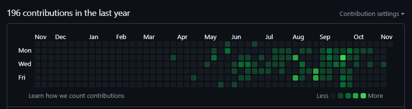

## Hi there, My name is Oussama 👋

**🚀 Final-Year ICT Engineering Student | Working Student in DevSecOps**

### 🔍 About Me
- 🎓 **Education**: ICT Engineering with a specialization in DevSecOps at INSAT, Tunisia.
- 💼 **Current Role**: DevSecOps Engineer (Working Student) at Speedykom GmbH
- 🌐 **Languages**: Python, Java, Golang, TypeScript, Ruby, C
- 💡 **Frameworks & Tools**: Django, Flask, Ruby on Rails, NestJS, Docker
- 🌱 **Current Focus**: Building CI/CD pipelines, integrating security into development lifecycles.

### 🔒 Private Contributions

### 🔧 Technical Skills
- **CI/CD**: Jenkins, GitHub Actions, SonarQube, Clair, OWASP ZAP, Trivy
- **Cybersecurity**: Penetration Testing, OSINT, Cryptography, Digital Forensics, Secure SDLC
- **Networking**: Designing, configuring, and monitoring networks 
- **Cloud & Containers**: Docker, Kubernetes, Azure, Docker Compose

### 🌟 Projects
- **Dark Web Monitoring Tool**: Automated web crawling system for detecting data breaches, using Python, Selenium, and EC2.
- **SIEM Implementation**: Automated network configuration and SIEM solution setup for monitoring logs and events.
- **Malware Analysis Tool on Cloud**: Automated static and dynamic malware analysis, leveraging cloud resources.

### 📫 Connect with Me

- **Email**: och.chaouachi@gmail.com
- **LinkedIn**: [Oussama Chaouachi](https://www.linkedin.com/in/oussama-chaouachi/)
- **GitHub**: [oussamachaouachii](https://github.com/oussamachaouachii)

Thanks for stopping by!
